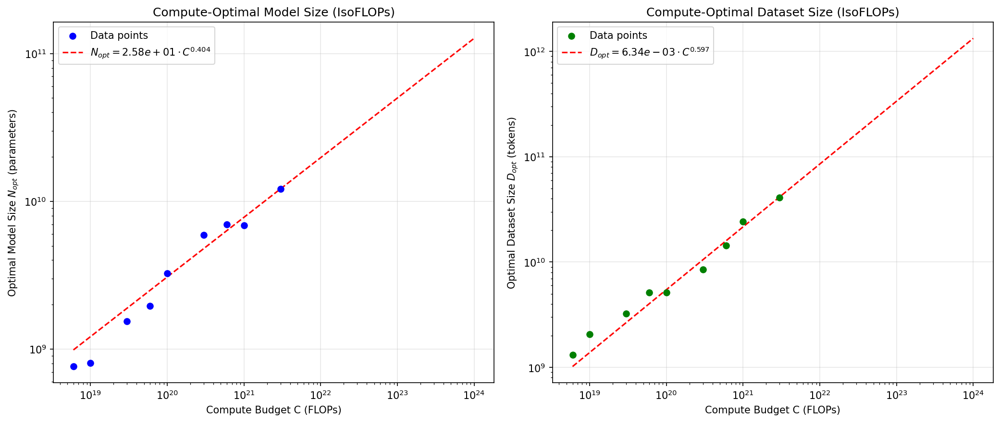

# CS336 Spring 2025 Assignment 3: Scaling

For a full description of the assignment, see the assignment handout at
[cs336_spring2025_assignment3_scaling.pdf](./cs336_spring2025_assignment3_scaling.pdf)

## Setup

0. Install uv

1. Add whatever dependencies you need with `uv add <package>`.

2. Run anything in the given environment with

```sh
uv run <command>
```

3. If you need the Python binary (for instance to reference the Python interpreter for VSCode), run
```sh
uv run which python
```

---

## Chinchilla IsoFLOPs Scaling Laws

### What is this?

A reproduction of the **IsoFLOPs method** from [Hoffmann et al. (2022)](https://arxiv.org/abs/2203.15556) ("Chinchilla") for finding compute-optimal scaling laws. Given a fixed compute budget, how should you split it between **model size** (N) and **dataset size** (D)?

### ELI5: How it works

Training a Transformer costs approximately **C = 6ND** FLOPs, where N is the number of parameters and D is the number of training tokens. Given a fixed budget C, spending more on N means less on D, and vice versa.

**Step 1 - Find the sweet spot for each budget:**
For each compute budget (e.g., 6x10^18 FLOPs), we have ~8 training runs with different model sizes. We pick the one with the lowest loss. That gives us one (C, N_opt) pair per budget -- 9 pairs total.

**Step 2 - Fit a power law:**
We assume the relationship looks like:

```
N_opt = k * C^a
```

This is not linear in the original space, but take the log of both sides:

```
log(N_opt) = log(k) + a * log(C)
```

Now it's a straight line in log-log space. We use `scipy.optimize.curve_fit` to find k and a (equivalent to linear regression on the log-transformed data).

**Step 3 - Extrapolate:**
Once we have k and a, plug in a larger C (like 10^23 or 10^24) to predict how big the model/dataset should be.

### Results

**Fitted power laws:**

| Scaling Law | Formula |
|---|---|
| Model size | N_opt = 25.8 * C^0.404 |
| Dataset size | D_opt = 6.34e-3 * C^0.597 |

The exponents (~0.4 and ~0.6) indicate that as compute grows, more of the budget should go to data than to model size -- consistent with the Chinchilla finding.

**Optimal N_opt and D_opt per compute budget (data points):**

| Compute Budget (FLOPs) | N_opt (params) | D_opt (tokens) | Loss |
|---|---|---|---|
| 6e18 | 7.62e8 | 1.31e9 | 5.900 |
| 1e19 | 8.07e8 | 2.07e9 | 5.618 |
| 3e19 | 1.54e9 | 3.25e9 | 5.107 |
| 6e19 | 1.95e9 | 5.12e9 | 4.831 |
| 1e20 | 3.25e9 | 5.12e9 | 4.653 |
| 3e20 | 5.90e9 | 8.47e9 | 4.311 |
| 6e20 | 6.97e9 | 1.43e10 | 4.121 |
| 1e21 | 6.86e9 | 2.43e10 | 4.003 |
| 3e21 | 1.21e10 | 4.12e10 | 3.773 |

**Extrapolated predictions:**

| Compute Budget | Predicted N_opt | Predicted D_opt |
|---|---|---|
| 10^23 FLOPs | ~50B parameters | ~337B tokens |
| 10^24 FLOPs | ~127B parameters | ~1.33T tokens |

### Scaling Law Plots



*Left: Compute-optimal model size vs. compute budget. Right: Compute-optimal dataset size vs. compute budget. Dashed red lines show the fitted power law extrapolated to 10^24 FLOPs.*

### Running the script

```sh
uv run python chinchilla_isoflops.py
```

This reads from `data/isoflops_curves.json` and produces `isoflops_scaling_laws.png`.
